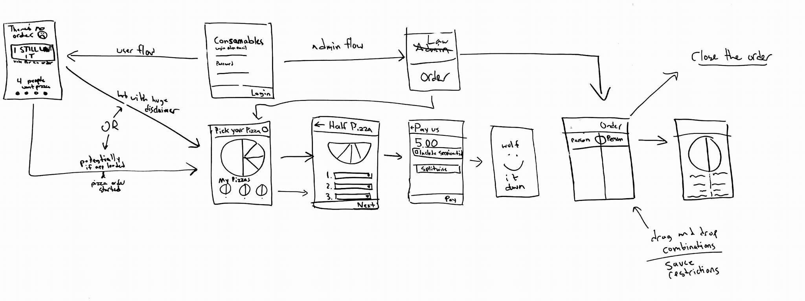

# AndroidPizza
Olin's #1 Pizza Ordering App for Android 4.1 and Above

#### Sam Myers and Danny Wolf

## Proposal

## App flow

## Additional features
In addition to fulfilling the requirements listed [here](https://github.com/MobileProto16/Mobile-Proto-16/blob/master/lab1/README.md), we have chosen to include the following features:

- [Firebase](https://firebase.google.com/) integration
- User authentication
- Comprehensive pizza ordering experience

## Agile methodology
We will be using GitHub Projects to organize our pizza experience, and to produce the app.

[Head there to see our latest progress and plans.](https://github.com/Consamables/AndroidPizza/projects/1)
